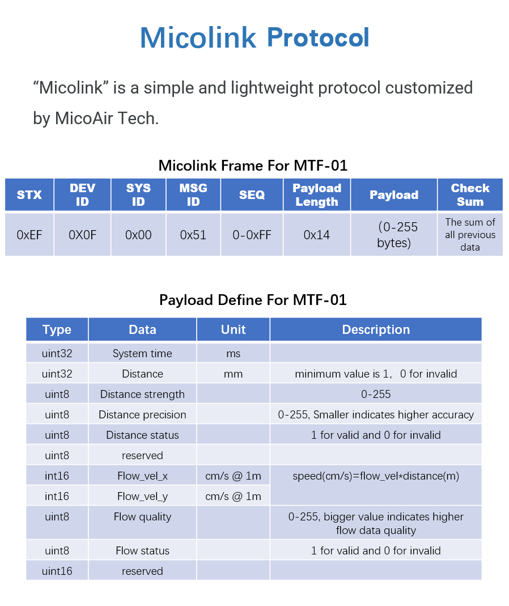
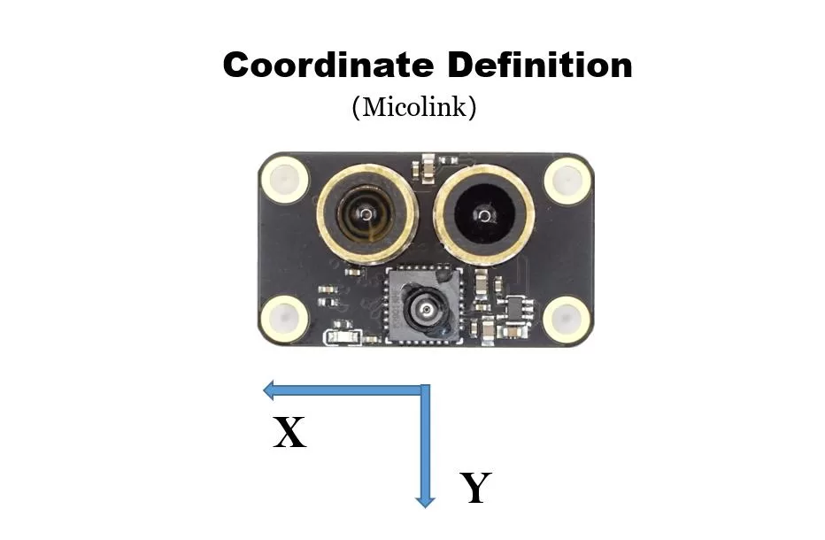

# MTF02p# Decoding Micolink Messages from MTF-01/01P/02
## Protocol Definition



## Coordinate Definition



## Decoding Sample Code

mtf01.h
```
#include <stdint.h>
#include <stdbool.h>
#include <string.h>

#define MICOLINK_MSG_HEAD            0xEF
#define MICOLINK_MAX_PAYLOAD_LEN     64
#define MICOLINK_MAX_LEN             MICOLINK_MAX_PAYLOAD_LEN + 7

/*
    Message ID
*/
enum
{
    MICOLINK_MSG_ID_RANGE_SENSOR = 0x51,     // Range Sensor
};

/*
    Message Structure Definition
*/
typedef struct
{
    uint8_t head;                      
    uint8_t dev_id;                          
    uint8_t sys_id;						
    uint8_t msg_id;                        
    uint8_t seq;                          
    uint8_t len;                               
    uint8_t payload[MICOLINK_MAX_PAYLOAD_LEN]; 
    uint8_t checksum;                          

    uint8_t status;                           
    uint8_t payload_cnt;                       
} MICOLINK_MSG_t;

/*
    Payload Definition
*/
#pragma pack (1)
// Range Sensor
typedef struct
{
    uint32_t  time_ms;		    // System time in ms
    uint32_t  distance;		    // distance(mm), 0 Indicates unavailable
    uint8_t   strength;	            // signal strength
    uint8_t   precision;	    // distance precision
    uint8_t   dis_status;	    // distance status
    uint8_t  reserved1;	            // reserved
    int16_t   flow_vel_x;	    // optical flow velocity in x
    int16_t   flow_vel_y;	    // optical flow velocity in y
    uint8_t   flow_quality;	    // optical flow quality
    uint8_t   flow_status;	    // optical flow status
    uint16_t  reserved2;	    // reserved
} MICOLINK_PAYLOAD_RANGE_SENSOR_t;
#pragma pack ()

```

mtf01.c
```
#include "mtf01.h"

/*
Users can use microlink_decode as their serial port data processing function
The minimum effective distance value is 10 (mm), and 0 indicates that the distance value is not available
optical flow velocity value unit：cm/s@1m
Calculation formula: speed(cm/s) = optical flow velocity * height(m)
*/

bool micolink_parse_char(MICOLINK_MSG_t* msg, uint8_t data);

void micolink_decode(uint8_t data)
{
    static MICOLINK_MSG_t msg;

    if(micolink_parse_char(&msg, data) == false)
        return;
    
    switch(msg.msg_id)
    {
        case MICOLINK_MSG_ID_RANGE_SENSOR:
        {
            MICOLINK_PAYLOAD_RANGE_SENSOR_t payload;
            memcpy(&payload, msg.payload, msg.len);

            /*
                You can get the sensor data here:
            
                distance           = payload.distance;
                distance strength  = payload.strength;
                distance precision = payload.precision;
                distance status    = payload.tof_status;
                flow velocity x    = payload.flow_vel_x;
                flow velocity y    = payload.flow_vel_y;
                flow quality       = payload.flow_quality;	
                flow status        = payload.flow_status;
            */
            break;
        } 

        default:
            break;
        }
}

bool micolink_check_sum(MICOLINK_MSG_t* msg)
{
    uint8_t length = msg->len + 6;
    uint8_t temp[MICOLINK_MAX_LEN];
    uint8_t checksum = 0;

    memcpy(temp, msg, length);

    for(uint8_t i=0; i<length; i++)
    {
        checksum += temp[i];
    }

    if(checksum == msg->checksum)
        return true;
    else
        return false;
}

bool micolink_parse_char(MICOLINK_MSG_t* msg, uint8_t data)
{
    switch(msg->status)
    {
    case 0:    
        if(data == MICOLINK_MSG_HEAD)
        {
            msg->head = data;
            msg->status++;
        }
        break;
        
    case 1:     // device id
        msg->dev_id = data;
        msg->status++;
        break;
    
    case 2:     // system id
        msg->sys_id = data;
        msg->status++;
        break;
    
    case 3:     // message id 
        msg->msg_id = data;
        msg->status++;
        break;
    
    case 4:     // 
        msg->seq = data;
        msg->status++;
        break;
    
    case 5:     // payload length
        msg->len = data;
        if(msg->len == 0)
            msg->status += 2;
        else if(msg->len > MICOLINK_MAX_PAYLOAD_LEN)
            msg->status = 0;
        else
            msg->status++;
        break;
        
    case 6:     // payload receive
        msg->payload[msg->payload_cnt++] = data;
        if(msg->payload_cnt == msg->len)
        {
            msg->payload_cnt = 0;
            msg->status++;
        }
        break;
        
    case 7:     // check sum
        msg->checksum = data;
        msg->status = 0;
        if(micolink_check_sum(msg))
        {
            return true;
        }
        
    default:
        msg->status = 0;
        msg->payload_cnt = 0;
        break;
    }

    return false;
}
```